# KnowledgeX - Enterprise Knowledge Intelligence Platform

<p align="center">
  
</p>


A production-oriented, **Agentic Retrieval-Augmented Generation (RAG)** platform that
answers natural-language questions across heterogeneous enterprise data — PDFs,
internal documents, CSV/SQL datasets and JSON logs — while enforcing **strict
role-based access control (RBAC)**, generating **grounded, cited answers**, and
exposing **confidence indicators** and **full retrieval traceability**.

> Runs end-to-end on a laptop with **no GPU and no API keys** (graceful offline
> fallbacks). 28 passing tests, CI, and a one-command demo that **proves zero
> cross-department data leakage.**

---

## KnowledgeX v2 Features

- **Agentic RAG Pipeline (LangGraph)** — Decomposed monolithic generation into a robust Graph workflow with `Planner`, `Retriever`, `Reasoner`, and `Responder` agents capable of multi-hop self-correction.
- **Advanced Retrieval** — Implemented **Cross-Encoder Reranking**, **Reciprocal Rank Fusion (RRF)**, and **Query Expansion** to push retrieval quality to the limit.
- **Local & Remote LLM Providers** — Modularized generation behind a provider abstraction supporting **Ollama (local)**, Anthropic, OpenAI, and Gemini, while retaining the deterministic offline extractive fallback.
- **Production Observability** — Full instrumentation via **OpenTelemetry**, **Prometheus**, and **Langfuse** for latency, throughput, and generation quality tracking.
- **Evaluation Framework** — Automated benchmarks generating static metrics on Precision, Recall, MRR, NDCG, and Groundedness.

## Executive Summary

Enterprises store critical knowledge in disconnected silos with very different shapes
and very different access rules. A naïve RAG system that embeds everything and
retrieves nearest neighbours is a **data-leak waiting to happen** — it will quote a
restricted finance document to an engineer. This platform treats **security as a
first-class retrieval concern**: every chunk inherits its document's security metadata,
RBAC is enforced *inside* the retrieval path (unauthorised content is removed before it
can reach the answer), every access decision is audited, and answers are generated
**only from retrieved, authorised context** with inline citations and a confidence
score — so the system says *"insufficient evidence"* rather than hallucinating.

## Business Problem

Staff need fast, accurate answers spread across PDFs, SQL/CSV databases, JSON logs and
technical/compliance reports — **but HR must not see Finance salaries, Engineering must
not see Finance budgets, and restricted audit findings must not leak to anyone without
clearance.** The platform must understand intent, route the query, retrieve across
sources, enforce RBAC, ground its answers in citations, and prove what it did.

## Enterprise Challenges

| Challenge | Consequence if unsolved | How the platform addresses it |
|---|---|---|
| **Information silos** | Knowledge fragmented across PDF/SQL/CSV/JSON; slow, manual lookup | Unified ingestion + a single fused index across all source types |
| **Access control** | Cross-department leakage, compliance breaches | Document-level RBAC enforced *inside* retrieval (defence in depth) |
| **Hallucination** | Confident, wrong answers erode trust | Extractive grounding + cite-or-refuse + honest confidence |
| **No traceability** | Cannot explain or audit answers | Citations, routing rationale, confidence, and an audit trail |
| **Heterogeneous data** | Structured + unstructured don't mix | Common `RawDocument` + cross-source retrieval in one scoring space |
| **Reproducibility / ops** | Hard to run, demo, or deploy | Offline fallbacks, Docker, CI, Makefile, env-var config |

## Business Impact

- **Reduced information silos** — one query reaches PDFs, databases and logs together.
- **Faster knowledge discovery** — intent routing + hybrid retrieval surface the right
  source in one step instead of manual hunting across systems.
- **Reduced operational overhead** — self-service answers cut repetitive lookups for HR,
  Finance, Engineering and Compliance teams.
- **Improved compliance** — clearance-aware access and a complete audit trail support
  GDPR/security obligations and audit readiness.
- **Improved security** — least-privilege, document-level RBAC prevents unauthorized
  data exposure by construction.
- **Better enterprise productivity** — grounded, cited answers are usable immediately,
  without second-guessing.
- **Improved trust through citations** — every claim links back to a specific document,
  page and snippet, so users (and auditors) can verify.

## Solution Overview

```
Data Sources → Ingestion → Chunking → Embeddings → Vector Store
   → Hybrid Retrieval → RBAC Enforcement → Context Assembly
   → Answer Generation → Citations & Confidence
```

Ten well-defined stages (offline indexing + online query), 13 components, exposed via a
FastAPI service and a CLI. Diagrammed in [docs/DIAGRAMS.md](docs/DIAGRAMS.md) and
explained in [architecture.md](architecture.md).

## Key Features

- **Heterogeneous ingestion** — PDF / internal docs / CSV / SQL / JSON → common model.
- **Intent routing** — transparent classifier boosts the right departments/sources.
- **Hybrid retrieval** — dense vectors ⊕ BM25, min-max fused; cross-source by design.
- **Strict RBAC** — department × clearance × explicit ACL, enforced in two layers.
- **Grounded generation** — extractive by default (zero hallucination, no key); optional
  **provider-agnostic** LLM backend (context-only, cite-or-refuse). Anthropic
  (`claude-opus-4-8`) is implemented; OpenAI / Gemini / Ollama / OpenRouter / self-hosted
  local models plug into the same seam.
- **Citations + confidence** — numbered citations with page/snippet; honest confidence
  with explicit refusal on low evidence.
- **Explainability + audit** — routing rationale, per-decision access reasons, audit log.
- **Resilient & reproducible** — automatic embedding/vector-store fallbacks; runs fully
  offline. Docker, CI, Makefile, env-var config.

## Architecture Overview

```
Ingestion → Chunking → Embedding → {Vector Store + BM25}
                                          │
User+Role → Router → Hybrid Retrieval → RBAC → Context Assembly → Citations
                                          │                            │
                                       Audit log            Confidence → Grounded Answer
```

- **Single fused index** — all source types share one ChromaDB collection and one BM25
  index, so a query can return a PDF policy, a SQL row and a JSON log ranked together.
- **Defence in depth** — RBAC applied twice: a vector pre-filter on department, then a
  full per-result check (clearance + ACL) before fusion.
- **Graceful degradation** — if SentenceTransformers weights or ChromaDB are unavailable,
  the platform falls back to a deterministic hashing embedder and an in-memory store. It
  always runs. See [architecture.md](architecture.md) and [docs/DIAGRAMS.md](docs/DIAGRAMS.md).

## Security Design

Access to a document is granted only when **all three** conditions hold: (1) the
document's department is in the role's allowed departments (or Admin `*`), (2) document
sensitivity ≤ role clearance on `public < internal < confidential < restricted`, and (3)
if the document declares `allowed_roles`, the role is listed (Admin bypasses). Policy
lives in [`data/rbac/access_policies.json`](data/rbac/access_policies.json); full threat
model in [security.md](security.md).

## Retrieval Design

- **Routing** classifies intent (`lookup / summarize / list / aggregate`) and ranks
  departments by keyword signal, *boosting* (not hard-filtering) matching sources.
- **Hybrid fusion** normalises dense and sparse scores per channel (min-max) and blends
  with `HYBRID_ALPHA` (default 0.6 toward dense). BM25 anchors exact identifiers
  (`INC-2025-021`, `OPS-5044`) that embeddings blur.
- **Cross-source diversification** caps chunks per document to span sources/departments.
- See [evaluation.md](evaluation.md) for why hybrid + grounding reduces hallucination.

## RBAC Design

| Role | Departments | Clearance | Demonstrated |
|---|---|---|---|
| **Admin** | `*` | restricted | ✓ full access |
| **HR** | HR | confidential | ✓ HR · ✗ Finance |
| **Finance** | Finance | confidential | ✓ Finance · ✗ HR |
| **Engineering** | Engineering, Operations | confidential | ✓ Engineering · ✗ Finance |
| **Compliance** | all (read) | restricted | ✓ cross-department read (audit) |

`python run_demo.py` asserts each row and prints **`RBAC enforcement: ALL SCENARIOS
PASS`** with zero forbidden-department leakage. Expected outputs in
[sample_outputs.md](sample_outputs.md).

## Explainability Features

Every `/query` response is fully traceable:

- **Retrieval traceability** — `routing.rationale` explains intent + chosen departments.
- **Source attribution** — `citations[]` resolve each `[n]` to doc, page and snippet.
- **Access decision logging** — `access_summary` lists allow/deny decisions with reasons;
  the full audit trail is at `GET /audit`.
- **Confidence indicators** — see below.

## Confidence Scoring

Confidence is driven by **lexical grounding** (how much of the question is covered by the
retrieved text), corroboration across chunks and source agreement — an embedding-agnostic
signal that stays honest under the offline fallback. It buckets to `high / medium / low`:

- High-coverage queries score ~0.7–0.9 → answered with citations.
- Out-of-corpus queries (e.g. *"airspeed velocity of an unladen swallow"*) score ≈0.03 →
  **explicit refusal** instead of a guess.

## Installation

Requires **Python 3.10+**.

```bash
cd enterprise-rag-platform
python -m venv .venv && source .venv/bin/activate   # recommended
pip install -r requirements.txt                     # or: make install
```

> **Offline note (resilience feature):** the platform prefers `all-MiniLM-L6-v2`
> embeddings and ChromaDB, but if model weights cannot be downloaded it falls back
> automatically — no action needed. `/health` reports the active backends.

## Quick Start

```bash
python -m data.generate_data        # 1. generate the synthetic corpus
python run_demo.py                  # 2. end-to-end demo + RBAC proof + audit
uvicorn src.api.main:app --reload   # 3. API at http://localhost:8000 (docs at /docs)
pytest -q                           # 4. 28 tests
```

Or use the task runner: `make install`, `make demo`, `make run`, `make test`, `make help`.

## Docker Usage

The image generates the corpus at build time, runs as a non-root user, and ships a
container `HEALTHCHECK`. It runs fully offline.

```bash
make docker-build          # or: docker build -t enterprise-rag-platform .
make docker-run            # or: docker run --rm -p 8000:8000 enterprise-rag-platform
curl -s localhost:8000/health | jq .
```

Configuration is twelve-factor: copy `.env.example` to `.env` (loaded automatically) or
pass variables via `-e` / your orchestrator. See [docs/RUNBOOK.md](docs/RUNBOOK.md).

## API Usage

```bash
uvicorn src.api.main:app --reload

curl -s localhost:8000/health | jq .          # active backends
curl -s localhost:8000/roles  | jq .          # RBAC roles + users

curl -s localhost:8000/query -H 'Content-Type: application/json' \
  -d '{"query":"Summarize latest audit findings.","role":"Compliance"}' | jq .

curl -s localhost:8000/query -H 'Content-Type: application/json' \
  -d '{"query":"Show finance budget allocations.","user_id":"fin_carol"}' | jq .

curl -s "localhost:8000/audit?limit=10" | jq .
```

Endpoints: `POST /query`, `GET /roles`, `GET /health`, `GET /audit`; OpenAPI at `/docs`.

## Demo Walkthrough

`python run_demo.py` runs in two parts:

**Part 1 — five canonical queries** (each grounded + cited):
1. *What is the remote work policy?* (HR) 2. *Show engineering deployment standards.*
(Engineering) 3. *Summarize latest audit findings.* (Compliance) 4. *Show finance budget
allocations.* (Finance) 5. *Show recent platform incidents.* (Engineering)

**Part 2 — six RBAC enforcement scenarios** asserting no forbidden-department content
appears in citations (HR↔Finance, Finance↔HR, Engineering↔Finance), ending with
`RBAC enforcement: ALL SCENARIOS PASS`.

Copy-paste commands in [sample_queries.md](sample_queries.md); real transcripts in
[sample_outputs.md](sample_outputs.md).

## Demo Screenshots

Terminal-based, so transcripts double as screenshots. To capture images for a slide deck
or submission:

```bash
# Save a full transcript
python run_demo.py > demo_transcript.txt

# Capture the API docs (Swagger UI) — start the server, then screenshot:
uvicorn src.api.main:app   # open http://localhost:8000/docs and screenshot
```

Place captured images under `docs/screenshots/` and reference them here, e.g.
``. Pre-captured transcripts are in
[sample_outputs.md](sample_outputs.md) so the platform's behaviour is visible without
running anything.

## Evaluation Methodology

See [evaluation.md](evaluation.md): hallucination mitigation, retrieval evaluation
(precision@k / routing accuracy / **RBAC leakage rate = 0**), citation validation,
reliability and enterprise scalability. An honest, reproducible component audit is in
[docs/FUNCTIONALITY_AUDIT.md](docs/FUNCTIONALITY_AUDIT.md).

## Project Structure

```
enterprise-rag-platform/
├── README.md  architecture.md  security.md  evaluation.md
├── sample_queries.md  sample_outputs.md
├── requirements.txt  pyproject.toml  Makefile  setup.sh  run_demo.py
├── Dockerfile  .dockerignore  .env.example
├── .github/workflows/ci.yml       # lint + tests (3.10–3.12) + Docker build
├── data/  (generate_data.py · documents/ · structured/ · logs/ · rbac/)
├── src/   (config · pipeline · cli · ingestion/ processing/ vectorstore/
│           retrieval/ security/ generation/ api/)
├── tests/ (datasets · rbac · retrieval · api)
├── docs/  (DATASETS · RUNBOOK · DIAGRAMS · FUNCTIONALITY_AUDIT)
└── diagrams/architecture.mmd
```

## Production Readiness

`pyproject.toml` (PEP 621 + console entry point), slim non-root `Dockerfile` +
`HEALTHCHECK`, `.dockerignore`, twelve-factor `.env`, GitHub Actions CI (lint + tests on
3.10/3.11/3.12 + Docker build/health-check), `Makefile`, and automatic embedding/vector-
store fallbacks. **Deliberately out of scope** (to stay focused on the challenge):
Kubernetes, Helm, Terraform — the container + env-var config drops into any of them later
without code changes.

## Future Roadmap

**Identity & access** — Azure AD / Active Directory integration, SSO (OIDC/SAML),
multi-tenant isolation (per-tenant collections), field/row-level RBAC for structured data.

**Retrieval & generation** — learned query routing, a human-feedback loop (thumbs up/down → training signal).

**Observability & governance** — an **observability dashboard**, **audit analytics**,
hash-chained tamper-evident audit log.
