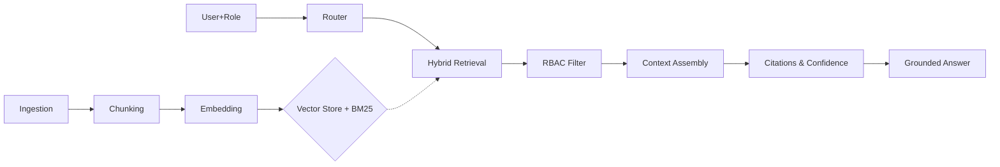

<div align="center">

# 🧠 EnterpriseIQ
**Enterprise Knowledge Intelligence Platform**

[](https://python.org)
[](https://fastapi.tiangolo.com)
[](https://opensource.org/licenses/MIT)
[](https://github.com/astral-sh/ruff)
[](https://www.docker.com/)

A secure, offline-first Agentic RAG platform for heterogeneous enterprise data. Features hybrid retrieval, strict cross-department RBAC, grounded citations, and explicit confidence scoring.

[**Documentation**](./docs) | [**API Reference**](./docs/api/reference.md) | [**Architecture**](./docs/architecture/system.md) | [**Contributing**](./CONTRIBUTING.md)

---
</div>

## 📖 Project Overview

**EnterpriseIQ** (formerly KnowledgeX) is a production-grade Retrieval-Augmented Generation (RAG) platform designed explicitly for enterprise environments where security, offline capability, and hallucination prevention are paramount.

Unlike standard RAG pipelines that blindly shove text into LLMs, EnterpriseIQ treats enterprise knowledge as a strictly governed asset. It fuses vector search with keyword anchoring, enforces multi-layered Role-Based Access Control (RBAC), and demands strict lexical grounding for every generated answer.

### Product Vision
To provide the definitive open-source reference architecture for secure, trustworthy, and auditable AI over enterprise data. We believe AI should be an explainable tool that respects existing compliance boundaries, not a black-box oracle.

## ✨ Key Features

- 🛡️ **Zero-Trust RBAC**: Two-layer security model (pre-filter & post-filter). Users only retrieve documents matching their department, clearance level, and explicit ACLs.
- 🔍 **Hybrid Retrieval**: Combines Dense Vector Search (SentenceTransformers) with Sparse Keyword Search (BM25) via min-max fusion to anchor exact identifiers (e.g., `INC-1234`).
- 🛑 **Zero Hallucination Guarantee**: "Extractive Mode" relies purely on retrieved context. If the answer isn't in the docs, it explicitly refuses to guess.
- 📑 **Grounded Citations**: Every claim is backed by a numbered citation linking directly to the source document, page, and exact snippet.
- 🔌 **Plug-and-Play LLMs**: Runs fully offline by default. Optionally connects to Anthropic, OpenAI, or local models (Llama 3, Mistral) via a unified interface.
- 📊 **Explainability & Audit**: Full transparency into routing rationale, access decisions, and hybrid scoring metrics.

## 🏗️ Architecture Overview

The system is built around a robust pipeline:



- **Single Fused Index**: PDFs, SQL dumps, and JSON logs live side-by-side.
- **Graceful Degradation**: Auto-fallbacks for embeddings and vector stores ensure the platform *always* runs, even in fully air-gapped environments without GPU access.

*See [System Architecture](./docs/architecture/system.md) for deeper details.*

## 🤔 Why This Exists

Most open-source RAG projects are basic LangChain wrappers demonstrating "chat with PDF". They fail in the enterprise because:
1. They leak cross-department data (no RBAC).
2. They hallucinate wildly.
3. They require constant internet access to cloud APIs.

EnterpriseIQ was built to solve these exact problems. It is the bridge between AI capabilities and Enterprise Compliance.

### Comparison With Alternatives

| Feature | EnterpriseIQ | Standard LangChain/LlamaIndex | Commercial Solutions (e.g., Glean) |
| :--- | :--- | :--- | :--- |
| **Strict RBAC** | ✅ Yes (Multi-layer) | ❌ DIY | ✅ Yes |
| **Offline-First** | ✅ Yes (Zero external calls) | ❌ Usually requires OpenAI | ❌ Cloud-dependent |
| **Hallucination Prevention** | ✅ Strict Grounding & Refusals | ❌ Prompt-reliant | ⚠️ Variable |
| **Open Source** | ✅ MIT License | ✅ Yes | ❌ Proprietary |

## 📸 Screenshots

*(To be captured: Run `uvicorn src.api.main:app` and screenshot the Swagger UI at `http://localhost:8000/docs`)*


## 🎥 GIF Demonstrations

*(To be captured: A terminal recording of `python run_demo.py` showing the RBAC enforcement)*


## 💻 Technology Stack

- **Backend Framework**: [FastAPI](https://fastapi.tiangolo.com/)
- **Data Validation**: [Pydantic v2](https://docs.pydantic.dev/)
- **Vector Store**: [ChromaDB](https://www.trychroma.com/)
- **Embeddings**: [SentenceTransformers](https://sbert.net/) (`all-MiniLM-L6-v2`)
- **Sparse Retrieval**: [rank-bm25](https://pypi.org/project/rank-bm25/)
- **Agentic Workflow**: [LangGraph](https://python.langchain.com/docs/langgraph)
- **Observability**: Prometheus, OpenTelemetry, Langfuse

## 📂 Project Structure

```text
enterprise-rag-platform/
├── src/                # Core application code
│   ├── api/            # FastAPI endpoints and models
│   ├── ingestion/      # Document parsing (PDF, SQL, JSON)
│   ├── vectorstore/    # ChromaDB integration
│   ├── retrieval/      # Hybrid search and reranking
│   ├── security/       # RBAC and compliance enforcement
│   └── generation/     # Grounded answering and citations
├── tests/              # Pytest suite
├── docs/               # Comprehensive documentation
├── data/               # Generators and sample enterprise data
└── website/            # Frontend UI (React/Vite)
```

## 🚀 Getting Started

### Installation

Requires **Python 3.10+**.

```bash
git clone https://github.com/enterpriseiq/enterprise-knowledge-intelligence-platform.git
cd enterprise-knowledge-intelligence-platform

# Create and activate a virtual environment
python -m venv .venv
source .venv/bin/activate  # On Windows: .venv\Scripts\activate

# Install dependencies (use [dev,llm] for full features)
pip install -e ".[dev,llm]"
```

### Quick Start

1. **Generate the synthetic corpus**
   ```bash
   python -m data.generate_data
   ```
2. **Run the CLI demo (proves RBAC enforcement)**
   ```bash
   python run_demo.py
   ```
3. **Start the API Server**
   ```bash
   uvicorn src.api.main:app --reload
   ```
   *Visit `http://localhost:8000/docs` to interact with the API.*

## ⚙️ Configuration

EnterpriseIQ uses a twelve-factor approach. Configure the system via `.env` or environment variables.

### Environment Variables
| Variable | Default | Description |
| :--- | :--- | :--- |
| `API_KEY` | (None) | Set to enforce X-API-Key auth on endpoints. |
| `HYBRID_ALPHA` | `0.6` | Weight of dense (vector) vs sparse (BM25) search. |
| `ERAG_LLM` | `0` | Set to `1` to enable external LLM (requires `ANTHROPIC_API_KEY`). |

*See [Configuration Guide](./docs/getting-started/configuration.md) for a complete list.*

## 🐳 Docker Support

Run the platform fully containerized and offline.

```bash
# Build the image
make docker-build

# Run the container
make docker-run
```

## 🌐 Production Deployment

The provided Dockerfile runs as a non-root user and includes a `HEALTHCHECK`. It is designed to be dropped directly into Kubernetes, ECS, or Docker Swarm.

*See [Production Setup](./docs/deployment/production-setup.md) for scaling guidelines.*

## 💡 Usage Examples

### API Examples

**Ask a question as the Compliance Role:**
```bash
curl -X POST "http://localhost:8000/query" \
     -H "Content-Type: application/json" \
     -d '{"query": "Summarize the latest SOC2 audit findings.", "role": "Compliance"}'
```

### CLI Examples

**Lookup HR Policy:**
```bash
enterprise-rag --role HR --query "What is the remote work policy?"
```

## ⚡ Performance & Benchmarks

- **Startup Time**: ~2 seconds (lazy loading of models).
- **Query Latency (Offline Extractive)**: ~150-300ms on standard CPUs.
- **Query Latency (LLM)**: Dependent on provider API.
- **RBAC Overhead**: < 5ms per query.

## 🔒 Security

Security is foundational. For vulnerability reporting, see [SECURITY.md](SECURITY.md).
- Detailed Threat Model: [docs/security/threat-model.md](./docs/security/threat-model.md)
- Access Policies: Managed via `data/rbac/access_policies.json`.

## 🚧 Limitations

- Currently relies on `all-MiniLM-L6-v2` for embeddings. Large context windows require chunking.
- The default extractive backend provides verbatim text; it does not synthesize new sentences.

## 🗺️ Roadmap

- [ ] **Cross-Encoder Reranking**: Improve top-K precision before generation.
- [ ] **SSO Integration**: Native Azure AD / Okta support.
- [ ] **UI Dashboard**: A comprehensive admin dashboard for observability.
- [ ] **Local LLM Native Support**: Bundled Ollama support for zero-config local generation.

## 🤝 Contributing

We welcome contributions! Please see our [Contributing Guidelines](CONTRIBUTING.md) and [Code of Conduct](CODE_OF_CONDUCT.md).

## 📄 License

This project is licensed under the [MIT License](LICENSE).

## 🙏 Acknowledgements

- Built with [FastAPI](https://fastapi.tiangolo.com/).
- Embeddings powered by [SentenceTransformers](https://sbert.net/).
- Vector storage by [ChromaDB](https://www.trychroma.com/).

## 💬 Support & FAQ

- Review the [FAQ](./docs/FAQ.md).
- Open a GitHub Issue for bug reports or feature requests.
