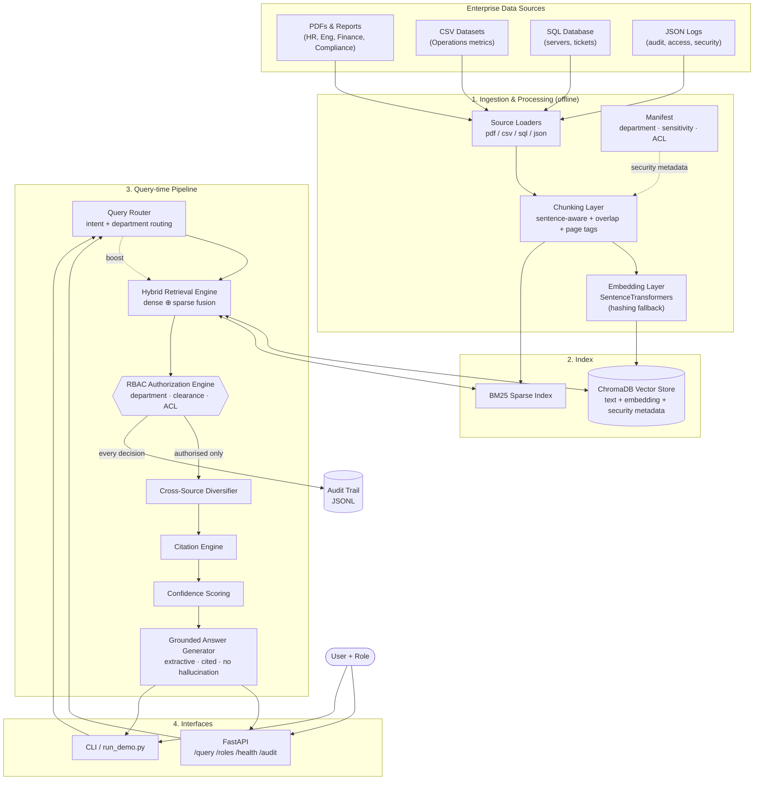

# Architecture

This document describes the conceptual architecture of the Secure Enterprise RAG
platform. The goal is a system that is **complete, secure and explainable** rather
than maximally advanced — a working pipeline a reviewer can read end to end.

## Diagram

## Processing pipeline (linear view)

End to end, a request flows through ten well-defined stages. Stages 1–5 run offline
(indexing); stages 6–10 run per query (online).

```mermaid
flowchart LR
    A["Data Sources<br/>PDF · CSV · SQL · JSON"] --> B["Ingestion<br/>loaders + security manifest"]
    B --> C["Chunking<br/>sentence-aware + overlap + page tags"]
    C --> D["Embeddings<br/>SentenceTransformers / hashing fallback"]
    D --> E[("Vector Store<br/>ChromaDB + BM25")]
    E --> F["Hybrid Retrieval<br/>dense ⊕ sparse fusion"]
    F --> G{{"RBAC<br/>department · clearance · ACL"}}
    G --> H["Context Assembly<br/>diversify · de-dup · order"]
    H --> I["LLM Generation<br/>grounded answer (extractive default)"]
    I --> J["Citations<br/>+ confidence + audit"]
```

| # | Stage | Module | Responsibility |
|---|---|---|---|
| 1 | **Data Sources** | `data/` + manifest | Heterogeneous enterprise corpus with security metadata. |
| 2 | **Ingestion** | `src/ingestion/` | Normalise PDF/CSV/SQL/JSON into `RawDocument` + metadata. |
| 3 | **Chunking** | `src/processing/chunker.py` | Overlapping, page-tagged chunks; inherit security metadata. |
| 4 | **Embeddings** | `src/processing/embedder.py` | Dense vectors (transformer or hashing fallback). |
| 5 | **Vector Store** | `src/vectorstore/`, `bm25_retriever.py` | Persist vectors + build sparse index. |
| 6 | **Hybrid Retrieval** | `src/retrieval/hybrid_retriever.py` | Fuse dense + sparse candidates. |
| 7 | **RBAC** | `src/security/rbac.py` | Drop every unauthorised candidate (pre-filter + re-check). |
| 8 | **Context Assembly** | `src/retrieval/cross_source.py` | Diversify across sources, cap per-doc, order by relevance. |
| 9 | **LLM Generation** | `src/generation/answer_generator.py` | Grounded answer from assembled context only (extractive by default; optional LLM via `ERAG_LLM=1`). |
| 10 | **Citations** | `src/generation/citation.py`, `confidence.py`, `audit.py` | Numbered citations, confidence label, audit record. |

> **Where the "LLM" sits.** Stage 9 is a pluggable *grounded generator*. The default
> backend is extractive (selects and cites verbatim sentences) so the system is
> reproducible and hallucination-free with no API key. Setting `ERAG_LLM=1` swaps in
> an LLM that receives **only** the assembled, authorised context and is instructed to
> answer from it and cite markers — the surrounding pipeline (RBAC, grounding,
> citations, confidence) is identical either way.

## Why this architecture minimizes hallucinations

Hallucination is addressed structurally at four points, not by a single prompt:

1. **Retrieve-then-generate, never generate-then-justify.** The generator can only
   emit content drawn from Stage 8's assembled context. There is no path by which the
   model "fills gaps" from parametric memory — the context window is the sole source
   of truth.
2. **Extractive default.** The shipped generator copies sentences verbatim from
   retrieved chunks and tags each with its citation marker, so *groundedness is 100% by
   construction*. Even with the optional LLM backend, it is constrained to context-only
   synthesis with mandatory citations.
3. **Cite-or-refuse with honest confidence.** Confidence is dominated by **query-term
   coverage in the retrieved text** — an embedding-agnostic signal of whether the corpus
   actually contains an answer. Below the low threshold the system returns an explicit
   *"insufficient authorised evidence"* message instead of guessing (e.g. an
   out-of-corpus question scores ≈0.03 and refuses).
4. **RBAC narrows, never invents.** Because unauthorised chunks are removed *before*
   generation, the model is never tempted to paraphrase restricted content it cannot
   cite. Every emitted claim resolves to a specific document, page and chunk in the
   citation list, and every retrieval/decision is written to the audit trail — so any
   ungrounded statement would be immediately visible.

Net effect: the only thing the system can say is something it retrieved, was authorised
to read, and can cite — or that it does not know.

## Component walk-through

The platform is organised as 13 components across an **offline indexing path** and an
**online query path**.

### 1. Data Ingestion Layer (`src/ingestion/`)
Four loaders convert raw sources into a common `RawDocument` (text + security
metadata). PDF extraction preserves `[[page=N]]` markers for citations; CSV and SQL
rows are linearised into text records so structured data is retrievable next to
prose; JSON logs are flattened one event per line. The **manifest**
(`data/documents/manifest.json`) is the source of truth for each document's
`department`, `sensitivity` and `allowed_roles`.

### 2. Document Processing Layer (`src/processing/`)
Normalises whitespace and prepares text for chunking. Page markers are consumed here.

### 3. Chunking Layer (`src/processing/chunker.py`)
Sentence-aware sliding window (default 900 chars, 150 overlap). Overlap prevents
answers being split across boundaries; page numbers are attached per chunk. **Every
chunk inherits the security metadata of its parent document** — this is what makes
chunk-level RBAC possible.

### 4. Embedding Layer (`src/processing/embedder.py`)
SentenceTransformers (`all-MiniLM-L6-v2`) dense embeddings, L2-normalised. A
deterministic **hashing embedder** is the automatic fallback when weights are
unavailable, so the pipeline never breaks. The active backend is reported by
`/health`.

### 5. Vector Store (`src/vectorstore/chroma_store.py`)
ChromaDB persistent collection (cosine space) storing text, embedding and metadata.
RBAC `where` filters are pushed into the query. An **in-memory cosine store** is the
fallback. The store also exposes `all_records()` to build the BM25 index.

### 6. Query Router (`src/retrieval/query_router.py`)
Transparent, rule-based intent + department classifier. It produces a `RouteDecision`
with a human-readable rationale and *boosts* matching departments rather than
hard-filtering, preserving cross-source recall. Clear extension point for a learned
classifier.

### 7. Hybrid Retrieval Engine (`src/retrieval/hybrid_retriever.py`)
Runs dense and sparse retrieval over a shared candidate pool, min-max normalises each
channel, blends with `HYBRID_ALPHA`, and applies routing boosts. This is also the
**cross-source engine**: because all sources live in one scoring space, results mix
freely.

### 8. RBAC Authorization Engine (`src/security/rbac.py`)
Department × clearance × ACL checks, applied as a vector pre-filter **and** a
per-candidate re-check (defence in depth). Produces a structured `AccessDecision` per
candidate that feeds explainability and the audit trail. Denied content is never
fused into the result.

### 9. Cross-Source Retrieval (`src/retrieval/cross_source.py`)
Coverage-aware diversification caps chunks per document and reports which departments
/ source types the final context spans.

### 10. Citation Engine (`src/generation/citation.py`)
Turns the surviving chunks into numbered, de-duplicated citations with document,
page, snippet and relevance — the anchor for grounding and traceability.

### 11. Confidence Scoring Engine (`src/generation/confidence.py`)
Combines query-term coverage, corroboration and source agreement into a 0–1 score and
a high/medium/low label. Deliberately embedding-agnostic so it stays honest under the
hashing fallback.

### 12. Grounded Answer Generator (`src/generation/answer_generator.py`)
Extractive by default: selects the most query-relevant sentences from the top chunks
and appends their citation markers — zero hallucination, no API key. An optional LLM
backend (gated behind `ERAG_LLM=1`) receives **only** retrieved context.

**Provider-agnostic by design.** Generation is the sole layer that touches an external
LLM, isolated behind one seam (`_generate_llm`); routing, RBAC, retrieval, citations and
confidence are provider-independent. **Anthropic (`claude-opus-4-8`) is the currently
implemented provider.** Others — **OpenAI, Google Gemini, Ollama, OpenRouter, or a
self-hosted local model** — can be added by implementing the same context-only call for
that provider and selecting it via configuration, with no change to the rest of the
pipeline.

### 13. FastAPI Interface (`src/api/`)
`/query`, `/roles`, `/health`, `/audit`, with Pydantic models and OpenAPI docs. The
pipeline is built once at startup (warm index/model).

## Key design decisions (don't-know choices, made explicit)

- **RBAC inside retrieval, not after generation.** Filtering post-hoc risks the model
  having already "seen" restricted text. We never let unauthorised chunks into the
  context.
- **Hybrid over pure-dense.** Enterprise corpora are full of codes/IDs where lexical
  match matters; BM25 complements semantic recall.
- **Extractive default generation.** For a security/compliance product, traceability
  and reproducibility beat fluency; grounding is guaranteed by construction.
- **Fallbacks everywhere.** Reviewers can run the system with zero network access and
  still see every feature work.
