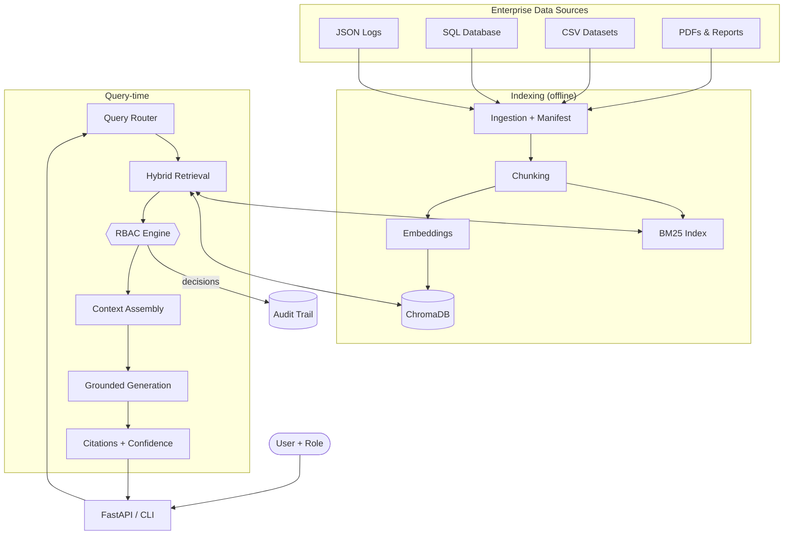
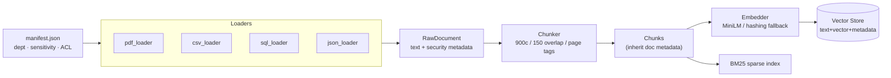
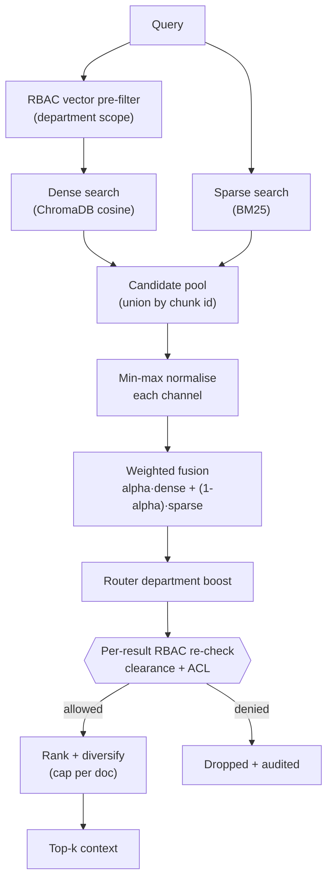
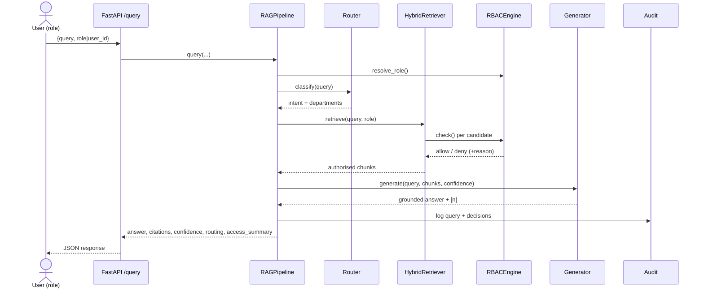
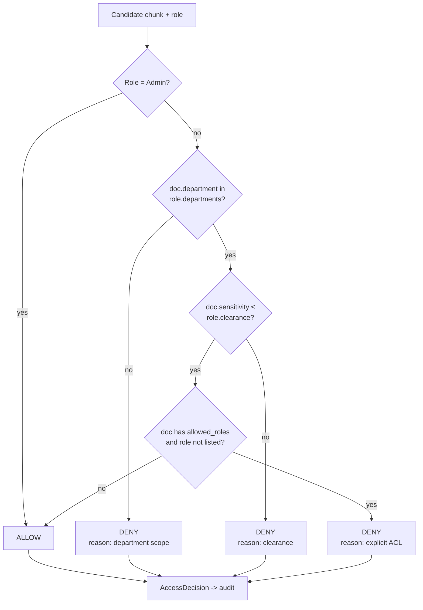
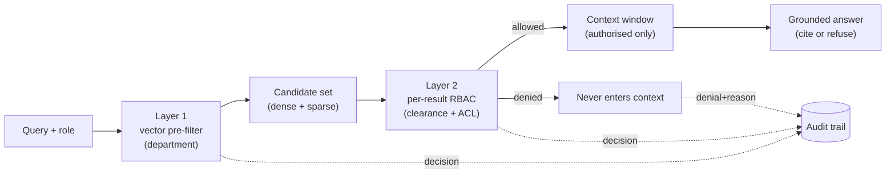

# Architecture & Flow Diagrams

Six diagrams covering the platform from different angles. All render natively on
GitHub. The canonical high-level source also lives at
[`diagrams/architecture.mmd`](../diagrams/architecture.mmd).

---

## 1. High-Level Architecture

---

## 2. Data Flow (ingestion → index)

---

## 3. Retrieval Flow (hybrid fusion)

---

## 4. Query Processing (end-to-end request)

---

## 5. RBAC Authorization (decision logic)

---

## 6. Security Flow (defence in depth)

> **Why two layers?** BM25 runs over the full corpus and is *not* department
> pre-filtered, so Layer 2's per-result check is the authoritative chokepoint that
> guarantees no unauthorised chunk — from either channel — ever reaches generation.
