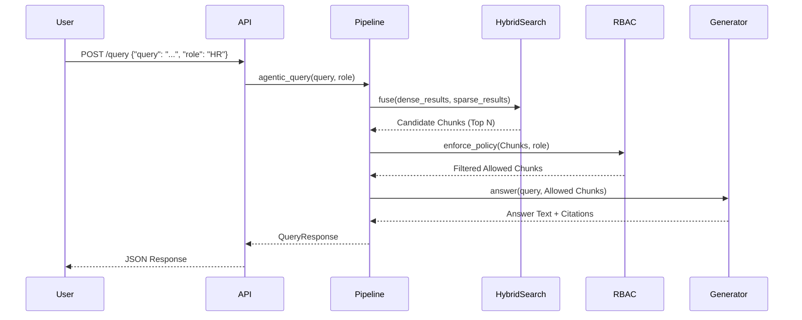

# Data Flow

Understanding how data moves through EnterpriseIQ during ingestion and querying.

## Ingestion Flow

1. **Source Reading:** `data.generate_data` simulates reading files from `data/documents`, `data/structured`, and `data/logs`.
2. **Chunking:** Documents are split into semantic chunks (e.g., 500 tokens).
3. **Dual Indexing:**
   - The chunk text is passed to SentenceTransformers to create a dense vector, which is inserted into ChromaDB.
   - The same chunk text is tokenised and inserted into the in-memory BM25 index.
4. **Metadata Attachment:** Department, sensitivity level, and allowed roles are attached as metadata to both stores.

## Query Data Flow

