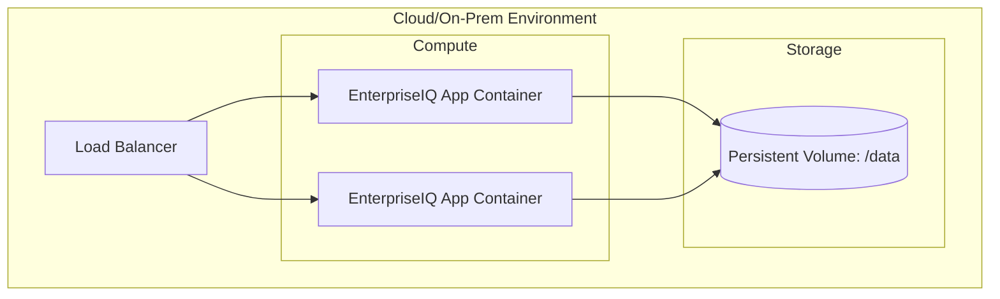
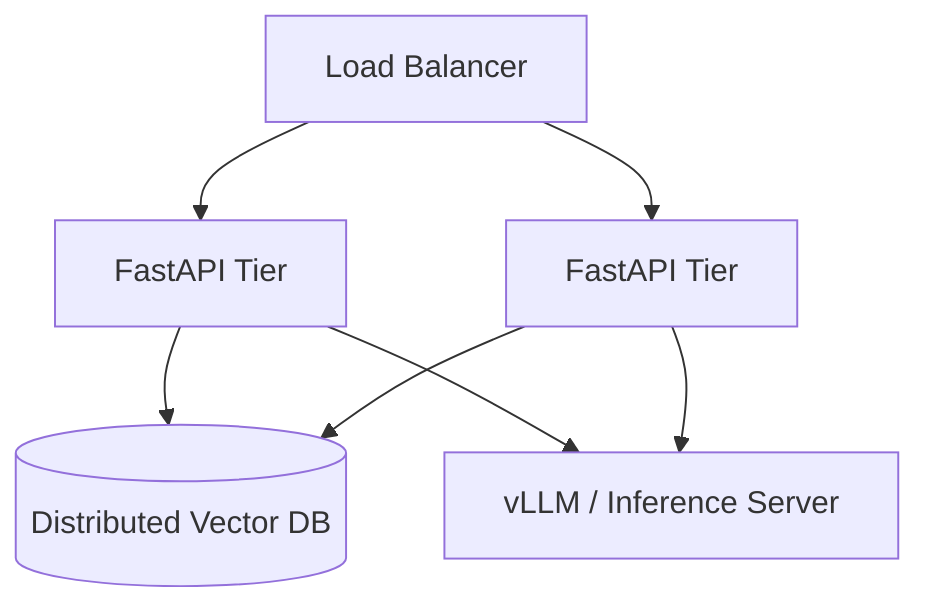

# Deployment Architecture

EnterpriseIQ is designed to be easily containerised and deployed in modern orchestrators like Kubernetes, Docker Swarm, or AWS ECS.

## Standard Container Deployment

The provided `Dockerfile` builds a single, stateless container that encapsulates the FastAPI server, the retrieval pipeline, and the local embedding models. The Vector Database (ChromaDB) and Sparse Index (BM25) are persisted to a mounted volume.

### Constraints
- **Concurrency:** ChromaDB runs in-memory/local-file mode. If scaling horizontally (multiple app containers), you must configure ChromaDB in client/server mode and run it as a separate service, OR use sticky sessions to a single container (not recommended for HA).

## Scaled / Distributed Deployment

For high-availability enterprise environments, the components should be decoupled:

1. **API Tier:** Multiple FastAPI instances running statelessly.
2. **Vector DB Tier:** A dedicated ChromaDB cluster or enterprise vector database (e.g., Pinecone, Qdrant).
3. **LLM Tier (Optional):** Dedicated inference servers (e.g., vLLM or Ollama) or managed APIs (Anthropic/OpenAI) if not using the offline extractive mode.

