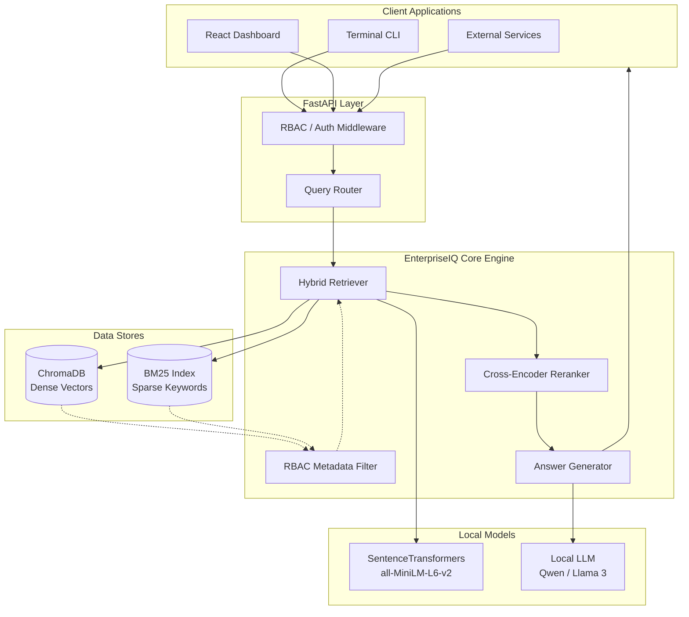
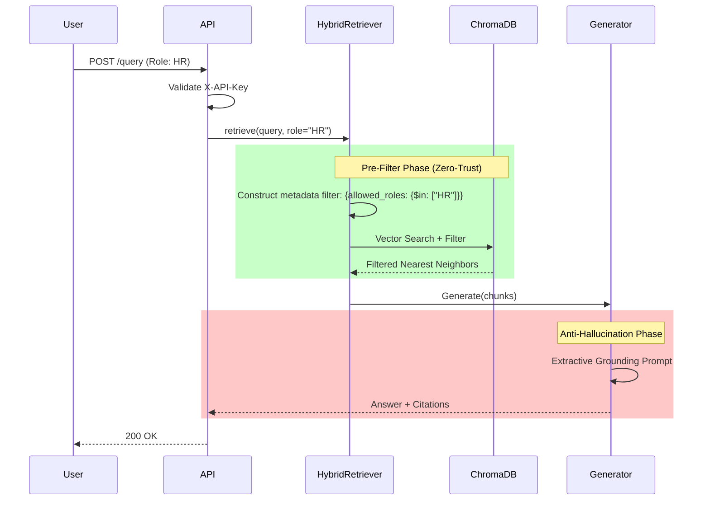
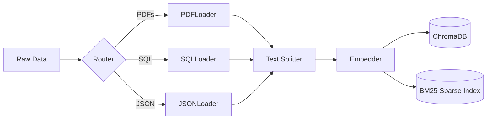

# Architecture Diagrams

## 1. System Architecture (Data Flow)

```mermaid
flowchart TD
    subgraph Client [Client Applications]
        CLI[Terminal CLI]
        UI[React Dashboard]
        API[External Services]
    end

    subgraph API_Layer [FastAPI Layer]
        Router[Query Router]
        Auth[RBAC / Auth Middleware]
    end

    subgraph Core [EnterpriseIQ Core Engine]
        Hybrid[Hybrid Retriever]
        Rerank[Cross-Encoder Reranker]
        Filter[RBAC Metadata Filter]
        Generator[Answer Generator]
    end

    subgraph Storage [Data Stores]
        Chroma[(ChromaDB\nDense Vectors)]
        BM25[(BM25 Index\nSparse Keywords)]
    end

    subgraph Models [Local Models]
        ST[SentenceTransformers\nall-MiniLM-L6-v2]
        LLM[Local LLM\nQwen / Llama 3]
    end

    CLI --> Auth
    UI --> Auth
    API --> Auth

    Auth --> Router
    Router --> Hybrid
    Hybrid --> ST
    Hybrid --> Chroma
    Hybrid --> BM25

    Chroma -.-> Filter
    BM25 -.-> Filter
    Filter -.-> Hybrid

    Hybrid --> Rerank
    Rerank --> Generator
    Generator --> LLM
    Generator --> Client
```

## 2. RBAC Enforcement Sequence

```mermaid
sequenceDiagram
    participant User
    participant API
    participant HybridRetriever
    participant ChromaDB
    participant Generator

    User->>API: POST /query (Role: HR)
    API->>API: Validate X-API-Key
    API->>HybridRetriever: retrieve(query, role="HR")

    rect rgb(200, 255, 200)
    Note over HybridRetriever,ChromaDB: Pre-Filter Phase (Zero-Trust)
    HybridRetriever->>HybridRetriever: Construct metadata filter: {allowed_roles: {$in: ["HR"]}}
    HybridRetriever->>ChromaDB: Vector Search + Filter
    ChromaDB-->>HybridRetriever: Filtered Nearest Neighbors
    end

    HybridRetriever->>Generator: Generate(chunks)

    rect rgb(255, 200, 200)
    Note over Generator: Anti-Hallucination Phase
    Generator->>Generator: Extractive Grounding Prompt
    Generator-->>API: Answer + Citations
    end

    API-->>User: 200 OK
```

## 3. Ingestion Pipeline

```mermaid
flowchart LR
    A[Raw Data] --> B{Router}
    B -->|PDFs| C[PDFLoader]
    B -->|SQL| D[SQLLoader]
    B -->|JSON| E[JSONLoader]

    C --> F[Text Splitter]
    D --> F
    E --> F

    F --> G[Embedder]
    G --> H[(ChromaDB)]
    G --> I[(BM25 Sparse Index)]
```
