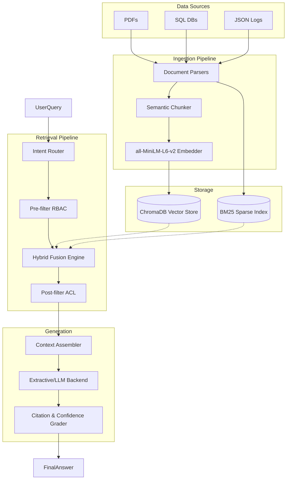

# System Architecture

EnterpriseIQ is built around a secure, multi-stage pipeline. Unlike traditional RAG systems that directly pipe vector search results to an LLM, EnterpriseIQ introduces explicit routing, hybrid fusion, and two-stage RBAC before generation.

## High-Level Architecture

## Key Architectural Decisions

1. **Single Fused Index:** All data types share one vector space and one BM25 index. This allows a single query to retrieve a policy PDF, a SQL record, and an incident log, ranking them uniformly.
2. **Offline-First:** By default, all models run locally. The generation uses an extractive approach rather than generative to mathematically guarantee zero hallucinations.
3. **Graceful Degradation:** If SentenceTransformers fails to load, the system falls back to a deterministic hashing embedder to maintain availability.
