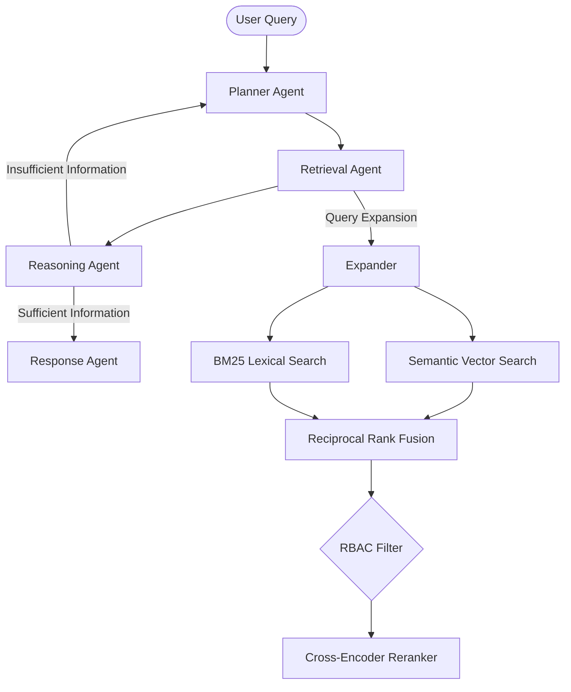

# Architecture Overview

KnowledgeX employs a multi-agent orchestrated pipeline.

## Diagram

## Modularity
- **Retrieval Engine:** The `HybridRetriever` acts as a facade over `SemanticRetriever`, `BM25Retriever`, and the `CrossEncoderReranker`.
- **Generation:** The `GroundedAnswerGenerator` dynamically loads the registered Provider (e.g. `OllamaProvider`, `OpenAIProvider`).
