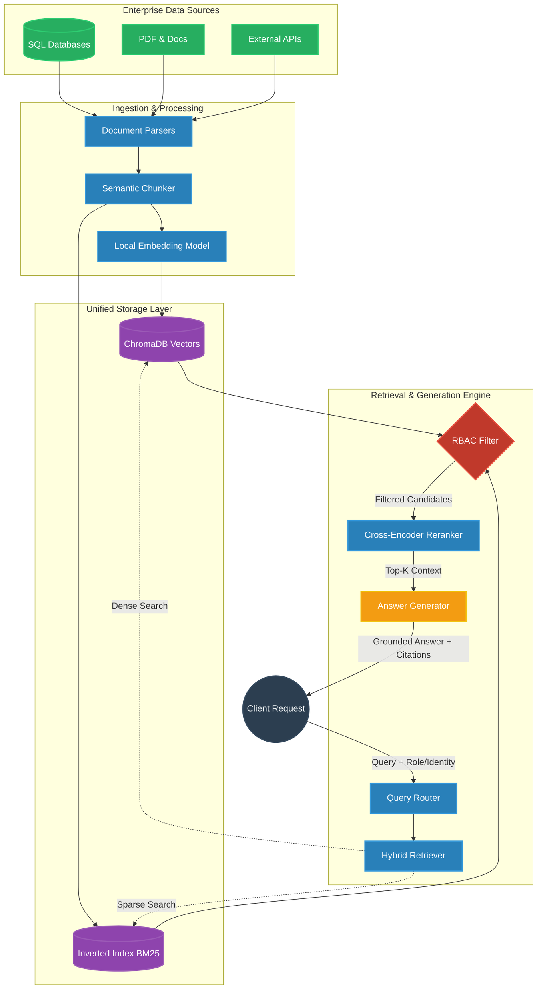

# Architectural Diagrams: EnterpriseIQ

Below are the Mermaid.js definitions for our core architectural diagrams. These should be rendered and styled to match the dark-mode aesthetic of our new branding.

## 1. High-Level System Architecture

This diagram shows the end-to-end flow from ingestion to generation, emphasizing the dual-retrieval and security layers.



## 2. Agentic Workflow Sequence Diagram

This diagram explains the step-by-step lifecycle of an API request hitting the `agentic_query` endpoint.

```mermaid
sequenceDiagram
    autonumber
    actor Client
    participant API as FastAPI /main.py
    participant RBAC as RBAC Engine
    participant Agent as LangGraph Agent
    participant Hybrid as Hybrid Retriever
    participant LLM as Local LLM

    Client->>API: POST /query (Query, UserID, Role)
    API->>RBAC: Resolve Effective Role & Clearance
    RBAC-->>API: (Role: Engineering, Clearance: Secret)
    API->>Agent: Initialize AgenticRAG State

    rect rgb(30, 40, 60)
        Note over Agent, Hybrid: Agent Planning & Execution Phase
        Agent->>Agent: Analyze Intent & Plan Steps
        Agent->>Hybrid: Execute Retrieval Tool
        Hybrid->>Hybrid: Perform Dense + Sparse Fusion
        Hybrid->>RBAC: Apply Post-Retrieval Filter
        RBAC-->>Hybrid: Return Authorized Chunks Only
        Hybrid-->>Agent: Filtered Context List
    end

    Agent->>LLM: Synthesize Answer (Strict Extractive Mode)
    LLM-->>Agent: Generated Text + Citation Markers
    Agent->>Agent: Format Citations & Calculate Confidence
    Agent-->>API: Final State (Answer, Citations, Metrics)

    API->>API: Log Audit Trail to Prometheus/SQLite
    API-->>Client: 200 OK (JSON Payload)
```



## 3. Air-Gapped Deployment Architecture

This diagram shows how EnterpriseIQ is deployed in a highly secure, offline environment.

```mermaid
graph LR
    classDef ext fill:#34495E,stroke:#2C3E50,stroke-width:2px,color:#FFF;
    classDef vpc fill:#1A252F,stroke:#34495E,stroke-width:2px,color:#FFF,stroke-dasharray: 5 5;
    classDef pod fill:#2980B9,stroke:#3498DB,stroke-width:2px,color:#FFF;

    subgraph "External Network (Internet)"
        Attacker(Unauthorized Access):::ext
    end

    subgraph "Enterprise VPC (Air-Gapped)":::vpc
        Gateway[API Gateway / Load Balancer]:::pod

        subgraph "Docker Compose / Kubernetes"
            App[FastAPI Backend\n+ local-models]:::pod
            UI[React Frontend]:::pod
            DB[(PostgreSQL / ChromaDB)]:::pod
            Prometheus[Prometheus Metrics]:::pod
        end

        InternalUser(Internal Employee):::ext
    end

    Attacker -.-x Gateway : "Blocked (No Ingress)"
    InternalUser --> Gateway
    Gateway --> UI
    Gateway --> App
    App <--> DB
    App --> Prometheus
```